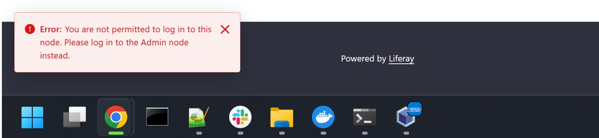

## Introduction ##
- This 'proof of concept' is designed for the scenario of preventing SAML SSO users with Administrator or other privileged Roles from logging into specific node(s) in a Liferay DXP implementation that has 'public' and 'private' nodes.
- The implementation is a custom OSGi module containing a Login Event LifecycleAction OSGi component that will check a SAML users Regular Roles and Site Roles in Liferay and determine whether a forced logout should be triggered for the user.
- It is specifically designed for use with SAML SSO where Liferay is the SAML SP using the out of the box SAML SP implementation. If the user has not logged in with out of the box Liferay SAML SP then it will not do anything.
- The solution assumes that each Liferay cluster node has a unique portal properties file that can be configured specifically for that Liferay cluster node.
- If a user is logged out by the component, a standard Liferay 'danger toast' is triggered using a custom Dynamic Include. The error message will be displayed for 10 seconds in the bottom right of the screen after the logout redirection completes:



## Performed Checks ##
- Based on the setup it will force a logout in the following scenarios for a SAML SSO user:
  - If the user has the Administrator Role or the Omni Administrator Role for the Virtual Instance.
  - If the user has any of the specified Regular Roles in the Virtual Instance (as defined in the custom ...regularRoleIds portal property).
  - If the user has the Site Owner Role or the Site Administrator Role in any of the specified Sites (as defined in the custom ...siteGroupIds portal property).
  - If the user has the Site Content Reviewer Role for one of the specified Sites (as defined in the custom ...siteGroupIds portal property).
  - If the user has any of the specified Site Roles in any of the specified Sites (as defined in the custom ...siteGroupIds and ...siteRoleIds portal properties).

## Setup ##
- Custom portal properties are used to allow individual nodes in the same customer to behave differently based on the portal properties for the specific node.
- Add the following portal properties to each node of the target environment:

| Property  | Type | Default | Description |
| -------- | ------- | ------- |  ------- |
| restrict.access.login.event.enabled | boolean | false | Set to true to enforce the restrictions for the current node. Set to false to not enforce restrictions.|
| restrict.access.login.event.regularRoleIds | comma separated IDs | empty string | Comma separated list of Regular roleId values. These can be roleIds from out of the box Regular Roles or from custom Regular Roles. Leave empty or don't include the property if this check not required. |
| restrict.access.login.event.siteGroupIds | comma separated IDs | empty string | Comma separated list of Site groupId values. These are the Sites whose Site Roles should be checked. Leave empty or don't include the property if this check is not required. |
| restrict.access.login.event.siteRoleIds | comma separated IDs | empty string | Comma separated list of Site Role roleId values. These can be the roleIds from out of the box Site Roles or from custom Site Roles. If using this check then the siteGroupIds property must also be populated. Leave empty or don't include if this chek is not applicable. |
  - Sample properties for a node where privileged uses are NOT allowed to login: 
```
restrict.access.login.event.enabled=true
restrict.access.login.event.regularRoleIds=43787,43788,43791
restrict.access.login.event.siteGroupIds=43375,43482,43555
restrict.access.login.event.siteRoleIds=43793,43794,43797
```
  - Sample properties for a node where privileged uses are allowed to login: 
```
restrict.access.login.event.enabled=false
restrict.access.login.event.regularRoleIds=
restrict.access.login.event.siteGroupIds=
restrict.access.login.event.siteRoleIds=
```
- Build the custom OSGi module.
- Start the Liferay cluster and deploy the custom OSGi module to each node.
- Confirm that the custom OSGi module deploys without any errors for example:
```
2025-10-17 10:38:24.715 INFO  ...[SAMLRestrictAccessLoginEvent:50] Activating
2025-10-17 10:38:24.716 INFO  ...[SAMLRestrictAccessLoginEvent:54] restrictAccessEnabled: true
2025-10-17 10:38:24.718 INFO  ...[SAMLRestrictAccessLoginEvent:62] Activated
2025-10-17 10:38:24.718 INFO  ...[SAMLRestrictAccessJSPDynamicInclude:35] Activating
2025-10-17 10:38:24.720 INFO  ...[SAMLRestrictAccessJSPDynamicInclude:39] restrictAccessEnabled: true
2025-10-17 10:38:24.721 INFO  ...[SAMLRestrictAccessJSPDynamicInclude:41] Activated
```
- Test the various scenarios based on the custom portal properties.

## Logging ##
- The logging for SAMLRestrictAccessLoginEvent class is mostly INFO level for test purposes. Change some (or all) to DEBUG as required.
- Sample logging where a user doesn't have a restricted Role:
```
2025-10-17 10:43:58.652 INFO  [http-nio-8080-exec-2][SAMLRestrictAccessLoginEvent:84] Verifying Roles for: Michael Wall
2025-10-17 10:43:58.743 INFO  [http-nio-8080-exec-2][SAMLRestrictAccessLoginEvent:112] User hasn't got a restricted Role: Michael Wall
```
- Sample logging where a user has a restricted Role:
```
2025-10-17 10:39:27.910 INFO  [http-nio-8080-exec-8][SAMLRestrictAccessLoginEvent:84] Verifying Roles for: max power
2025-10-17 10:39:27.910 INFO  [http-nio-8080-exec-8][SAMLRestrictAccessLoginEvent:119] User has Administrator Role: max power
2025-10-17 10:39:27.910 INFO  [http-nio-8080-exec-8][SAMLRestrictAccessLoginEvent:89] Forcing logout for: max power

2025-10-17 10:39:03.283 INFO  [http-nio-8080-exec-10][SAMLRestrictAccessLoginEvent:84] Verifying Roles for: basil rathbone
2025-10-17 10:39:03.283 INFO  [http-nio-8080-exec-10][SAMLRestrictAccessLoginEvent:133] User has a restricted Regular Role: basil rathbone
2025-10-17 10:39:03.283 INFO  [http-nio-8080-exec-10][SAMLRestrictAccessLoginEvent:89] Forcing logout for: basil rathbone

2025-10-17 10:38:38.855 INFO  [http-nio-8080-exec-3][SAMLRestrictAccessLoginEvent:84] Verifying Roles for: arthur beesley
2025-10-17 10:38:38.871 INFO  [http-nio-8080-exec-3][SAMLRestrictAccessLoginEvent:159] User has a Site Administrator or Site Owner Role: arthur beesley
2025-10-17 10:38:38.871 INFO  [http-nio-8080-exec-3][SAMLRestrictAccessLoginEvent:89] Forcing logout for: arthur beesley

2025-10-17 10:40:01.713 INFO  [http-nio-8080-exec-6][SAMLRestrictAccessLoginEvent:84] Verifying Roles for: barry white
2025-10-17 10:40:01.713 INFO  [http-nio-8080-exec-6][SAMLRestrictAccessLoginEvent:179] User has a restricted Site Role: barry white
2025-10-17 10:40:01.713 INFO  [http-nio-8080-exec-6][SAMLRestrictAccessLoginEvent:89] Forcing logout for: barry white
```

## Removing the Liferay 'danger toast' error message ##
- Remove the cookie setting logic from com.mw.saml.login.event.SAMLRestrictAccessLoginEvent.java:
```
Cookie cookie = new Cookie(SAMLRestrictAccessConstants.COOKIES.SAML_LOGIN_RESTRICT_ACCESS, SAMLRestrictAccessException.class.getSimpleName());
cookie.setMaxAge(COOKIE_MAX_AGE_SECONDS);
CookiesManagerUtil.addCookie(CookiesConstants.CONSENT_TYPE_NECESSARY, cookie, httpServletRequest, httpServletResponse);
```
- Remove the Dynamic Include class:
```
com.mw.saml.login.event.SAMLRestrictAccessJSPDynamicInclude.java
```
- Remove the Dynamic Include JSPs:
```
META-INF/resources/dynamic_include/init.jsp
META-INF/resources/dynamic_include/saml_restrict_access_error.jsp
```

## TODO / Configuration Improvements ##
- The set of Sites is read once per node from the portal property restrict.access.login.event.siteGroupIds for convenience and performance.
  - A restart is required to update the property e.g. if a Site is added to the system.
  - The code can be updated to dynamically generate the set of Sites, but bear in mind the code would need to retrieve the set of Sites each time the code is called to ensure it has the latest set of Sites.
  - Alternatively the set of Sites could be moved to custom Instance Settings.
- The sets of restricted Regular Roles and Site Roles are read once per node from the portal properties for convenience and performance.
  - A restart is required to update these properties e.g. if a new restricted Role of either type is added to the system.
  - These values could be moved to custom Instance Settings.
 - Note: Do not attempt to move the restrict.access.login.event.enabled property to custom Instance Settings.
   - Instance Settings (and System Settings) are shared by all nodes in the cluster via the Configuration_ database table in ALL circumstances.

## Notes ##
- This is a ‘proof of concept’ that is being provided ‘as is’ without any support coverage or warranty.
- The implementation uses a custom OSGi module meaning it is compatible with Liferay DXP Self-Hosted and Liferay PaaS, but is not compatible with Liferay SaaS.
- The implementation was tested locally using Liferay DXP 2025.Q1.0 LTS configured as a SAML SP with Keycloak configured as a SAML IdP.
- JDK 21 is expected for both compile time and runtime.
- The module can be deployed to all nodes in the cluster, but ensure that restrict.access.login.event.enabled is not set to true on each node, otherwise privileged users will be prevented from logging to any of the cluster nodes with SAML SSO.
